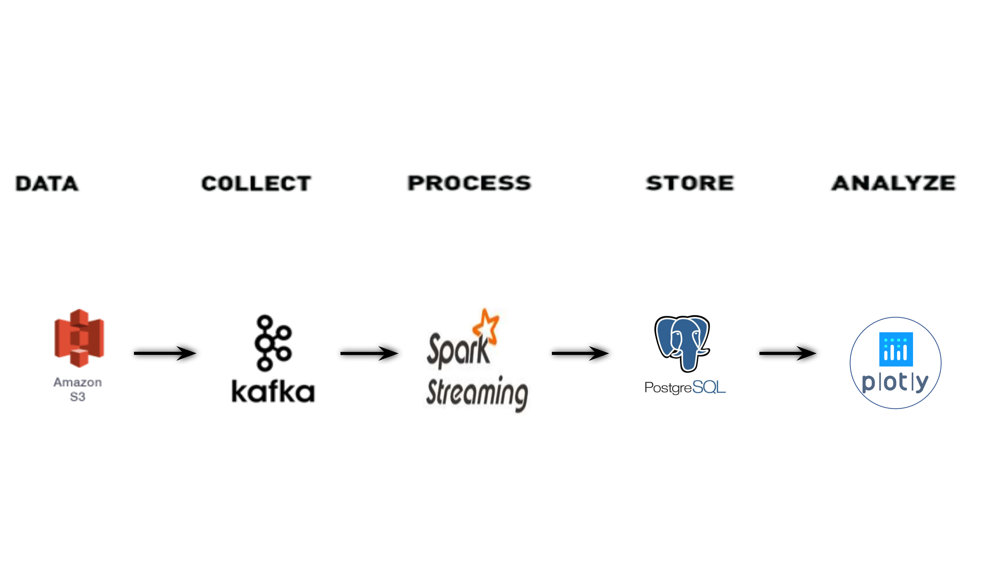

# Transit Logic
It is my Insight Data Engineering project (Summer 2020). It is a platform to help micro-mobility operators have a better decision-making process and maximize their asset utilization. The Transit Logic proejct is presented [here](https://docs.google.com/presentation/d/1Jr13kSvMab7EqSkpLz6PW41JB4xvtoiu6_nLKo-NfUk/edit?usp=sharing).

## Introduction
Micromobility refers to all shared-use fleet of small, lightweight, and fully or partially human-powered vehicles such as Ebikes, electric scooters, electric skateboards, shared bicycles, and electric pedal-assisted (pedelec) bicycles. They primarily address the transit desert or first/last mile problem in urban areas. 

The shared micromobility operators compete in a highly competitive market with a low-profit margin. Lime, Bird, Spin, Jump, Bolt, and Skip are some of the major players operating in the market. Because of supply and demand imbalance, they need to move around their inventory to capture more demand and increase their revenue. 

The **T**ransit**L**ogic is a platform to ingest real-time data from different sources to provide operators with analytics dashboard reporting KPIs like idle time per vehicle, average available vehicle per operators, etc. 

## Architecture
The data resides in an Amazon S3 bucket from where it is streamed into Apache Kafka. A Confluent Kafka cluster is set up on Amazon EC2 node. Also, a schema registry is configured that handles the evolution of the data schema. Avro is chosen as a serialization format to work with the schema registry. Data is then passed to the Faust streaming app for data processing and extracting and adding geo hash to output streams.
The Kafka connector sinks the output streams into the Elasticsearch for further spatial queries and visualization by Grafana.  

## Dataset
For project demonstration, real-time bike and scooter sharing data are collected from District Department of Transportation public API [Link](https://ddot.dc.gov/page/dockless-api). The approximate volume of data for 5 operators is more than 50 GB or 300 million records depending upon API availability and response rate. The sample data is available upon request. 

## Engineering challenges

1. Inconsistent Schema

Problems:

Operators' rideshare data have different schemas. They might also evolve over time. New versions might not be compatible with older schemas. To avoid downtime of the pipeline, the update to newer code versions needs to happen during production time.

Solutions:

Confluent Kafka uses a schema registry that allows the evolution of the data schema. Adding default values to the data schema allows for full backward and forward compatibility between old and new versions of the Kafka applications. These versions can then run in simultaneously and process and consume messages of all schema versions.

2. Point Data Aggregation

Problems:
Because of GPS signal error, point data with slightly different latitudes and longitudes represent the same location. 

Solutions:
Geohashing techniques is used to aggregate point data and generate KPIs for visualization.

3. Geographic object storage

Since geohash is used for aggregation, they could be stored either as geographic objects (Polygons) or alphanumeric string. The former need much more storage space while it's much easier to handle for visualization. The latter is only supported by a limited number of databases like Elsticsearch.
